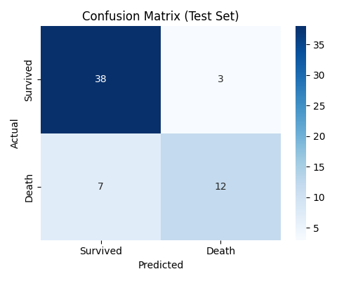
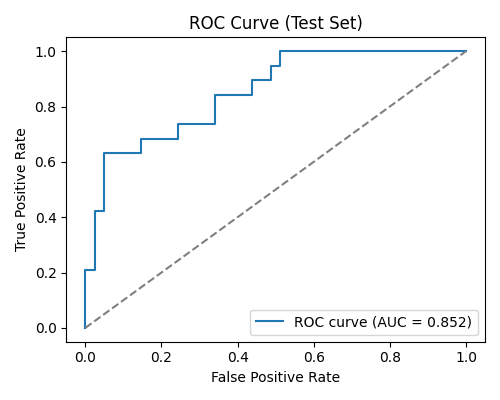
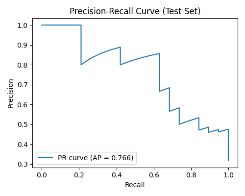

❤️ Heart Failure Prediction

Predicts the likelihood of death from heart failure using clinical patient data and supervised machine learning. Cardiovascular diseases are the leading cause of death globally, claiming an estimated **17.9 million lives each year** (WHO). Early detection through predictive modeling can support timely medical intervention and better resource allocation in clinical settings.

---

## 📊 Dataset

- **Source:** [Kaggle — Heart Failure Prediction Dataset](https://www.kaggle.com/code/karnikakapoor/heart-failure-prediction-ann/input)
- **Records:** 299 patients
- **Target:** `DEATH_EVENT` (binary: 0 = survived, 1 = death)

| Feature | Description |
|---|---|
| `age` | Patient age (years) |
| `anaemia` | Decrease of red blood cells (0/1) |
| `creatinine_phosphokinase` | Level of CPK enzyme in blood (mcg/L) |
| `diabetes` | Whether patient has diabetes (0/1) |
| `ejection_fraction` | % of blood leaving the heart per contraction |
| `high_blood_pressure` | Whether patient has hypertension (0/1) |
| `platelets` | Platelets in blood (kiloplatelets/mL) |
| `serum_creatinine` | Level of creatinine in blood (mg/dL) |
| `serum_sodium` | Level of sodium in blood (mEq/L) |
| `sex` | Male/Female (0/1) |
| `smoking` | Whether patient smokes (0/1) |
| `time` | Follow-up period (days) |

---

## 🛠️ Tech Stack

- **Python**
- **Pandas / NumPy** — data manipulation
- **Matplotlib / Seaborn** — visualization
- **scikit-learn** — Logistic Regression, GridSearchCV, model evaluation

---

## 📁 Project Structure
Heart-Failure-Prediction/

├── data/

│   └── heart_failure_clinical_records_dataset.csv

├── src/

│   ├── data_preprocessing.py   # Load, clean, split, scale

│   ├── train_model.py          # GridSearchCV + threshold tuning

│   └── evaluate.py             # Test-set evaluation + plots

├── models/                     # Saved model, scaler, threshold (.pkl)

├── outputs/                    # Confusion matrix, ROC, PR curve plots

├── requirements.txt

├── .gitignore

└── README.md

---

## 🚀 How to Run

```bash
# 1. Clone the repo
git clone https://github.com/leviupendo/Heart-Failure-Prediction.git
cd Heart-Failure-Prediction

# 2. Set up environment
python -m venv venv
venv\Scripts\activate          # Windows
pip install -r requirements.txt

# 3. Train the model
python src/train_model.py

# 4. Evaluate on test set
python src/evaluate.py
```

---

## 🧠 Modeling Approach

- **Algorithm:** Logistic Regression
- **Hyperparameter tuning:** `GridSearchCV` (5-fold stratified CV) across `C`, `penalty` (L1/L2), `solver`, and `class_weight` (to handle class imbalance — ~32% positive class)
- **Threshold tuning:** Default 0.5 threshold is not always optimal for imbalanced clinical data. We scan the precision-recall curve on the training set and select the threshold that **maximizes F1-score**, balancing false negatives (missed at-risk patients) against false positives.
- **Scaling:** `StandardScaler` applied to continuous features only (binary features left untouched)

---

## 📈 Results

> Fill in your actual numbers from `evaluate.py` output after running it.

| Threshold | Precision | Recall | F1-score |
|---|---|---|---|
| Default (0.5) | — | — | — |
| Tuned (F1-optimized) | — | — | — |

**ROC-AUC:** —

### Confusion Matrix


### ROC Curve


### Precision-Recall Curve


---

## 🔮 Future Improvements

- Compare against tree-based models (Random Forest, XGBoost)
- SHAP values for feature-level interpretability
- Cross-validation on threshold selection (currently tuned on train set only)
- Deploy as a simple Streamlit demo for clinical risk scoring

---

## 👤 Author

**Levi Omondi (Omosh)**
- GitHub: [@leviupendo](https://github.com/leviupendo)
- LinkedIn: [linkedin.com/in/levi-omondi-7421522b7](https://linkedin.com/in/levi-omondi-7421522b7)
